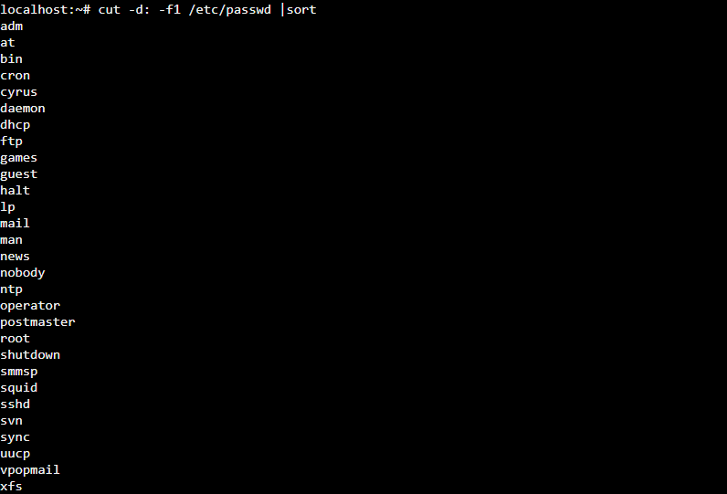
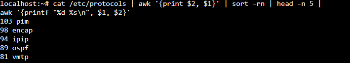

# Практическое занятие №1. Введение, основы работы в командной строке


## Задача 1
```cut -d: -f1 /etc/passwd |sort```



## Задача 2
```cat /etc/protocols | awk '{print $2, $1}' | sort -rn | head -n 5 | awk '{printf "%d %s\n", $1, $2}'```



## Задача 3
```
#!/bin/bash
# Проверяем, был ли передан аргумент
!
if [ $# -eq 0 ]; then

    echo "Использование: $0 \"Ваш текст\""

    exit 1

fi

# Получаем текст из аргумента

text="$1"

# Вычисляем длину текста

length=${#text}

# Создаем верхнюю и нижнюю границы

border=$(printf "%0.s-" $(seq 1 $((length + 2))))

border="+$border+"

# Выводим баннер

echo "$border"

echo "| $text |"

echo "$border"
```            


