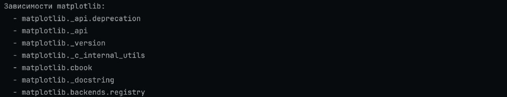
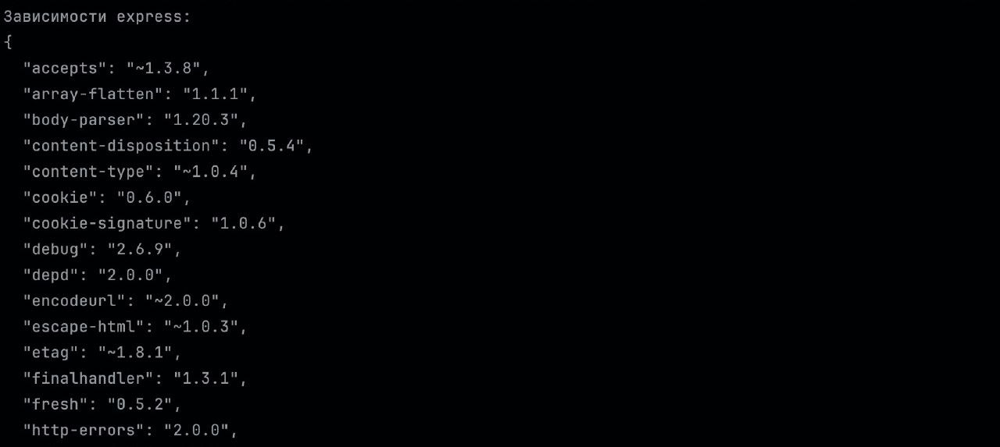

# Практическое занятие №2. Менеджеры пакетов

## Задача 1

1. 
2. `git clone https://github.com/matplotlib/matplotlib.git`
3. `cd matplotlib`'
4. `python setup.py install`
### code preview in the file code/matplotlibInfo.py

## Задача 2

1. `node expressInfo.js `
2. 
3. `git clone https://github.com/expressjs/express.git`
4. `npm install`
### code preview in the file code/expressInfo.js
