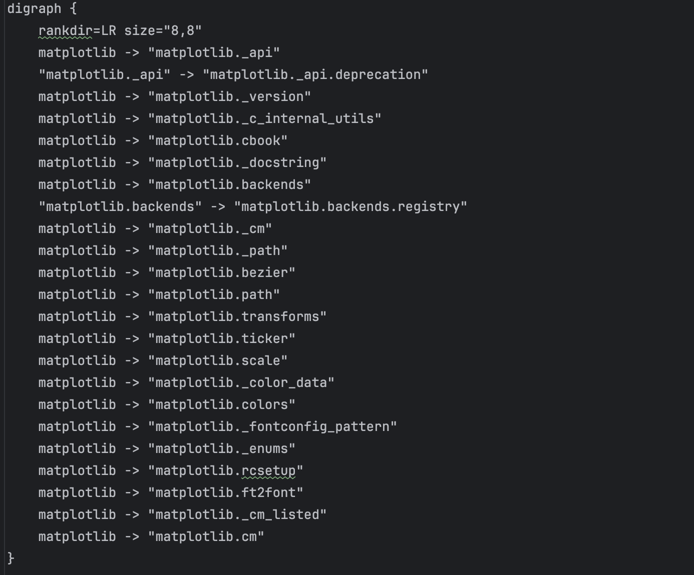
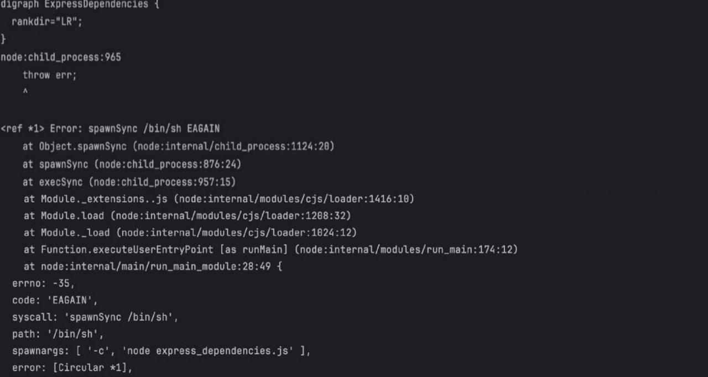
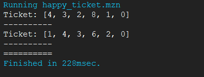
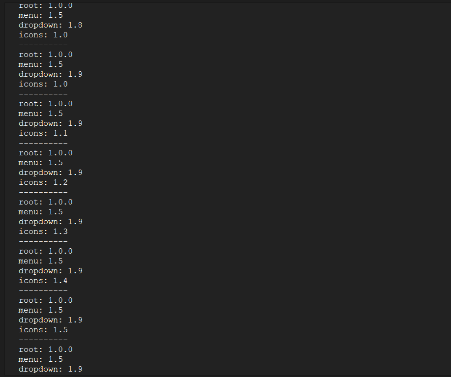
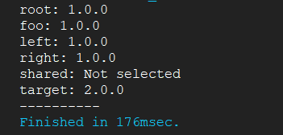

# Практическое занятие №2. Менеджеры пакетов

## Задача 1

1. 
2. `git clone https://github.com/matplotlib/matplotlib.git`
3. `cd matplotlib`'
4. `python setup.py install`
### code preview in the file code/matpllibInf.py

## Задача 2

1. `node expressInfo.js `
2. 
3. `git clone https://github.com/expressjs/express.git`
4. `npm install`
### code preview in the file code/expressInfo.js

## Задача 3

1. `node express_dependencies.js`
2. 
3. `python matplotlib_dependencies.py`
4. 
### code preview in the file code/matplotlib_dependencies.py and code/express_dependencies.js

## Задача 4

1. 
### code preview in the file code/happy_tickets.mzn

## Задача 5

1. 
### code preview in the file code/pack_dependencies.mzn

## Задача 6

1. 
### code preview in the file code/complex_pack_dependencies.mzn

